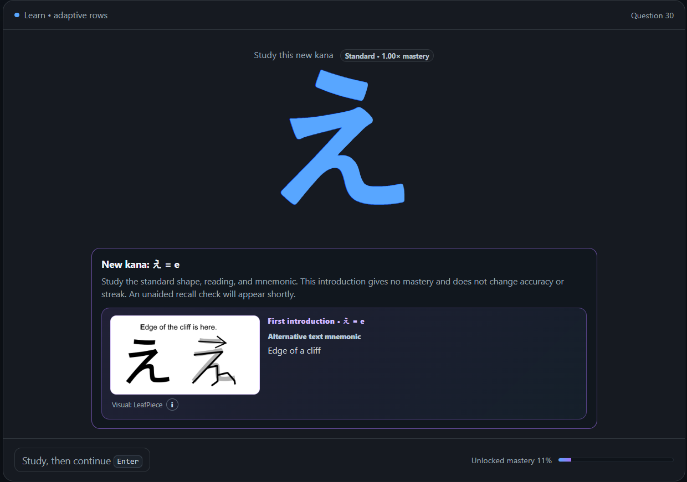
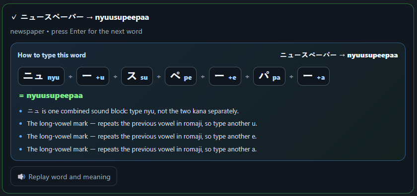

# Japanese Kana Sprint

Three offline, adaptive reading trainers for Japanese kana:

- **Hiragana Sprint** — hiragana characters, combinations, beginner words, and Japanese numbers.
- **Katakana Sprint** — katakana characters, practical combinations, and beginner words.
- **Kana Mix** — interleaved hiragana and katakana practice, plus the shared Japanese-number course.

All three trainers share the same interface and learning system. Hiragana and Katakana keep their own mastery records; Kana Mix reads and updates both sets.

## Start the trainers

No installation or web server is needed. Open either file directly in a modern browser:

- `hiragana_sprint.html`
- `katakana_sprint.html`
- `kana_sprint.html`

Keep the `shared`, `lessons`, and `fonts` folders beside the HTML files. Moving only an HTML file will prevent the trainer from loading.

## Practice modes

### Learn

Introduces rows gradually. A completely new kana first appears in standard print with its reading and full mnemonic; this study step changes neither mastery, accuracy, nor streak. An unaided check follows after several intervening questions. Weak kana return more often, while successful unaided practice unlocks later rows. Rehearsal can also unlock a row when you demonstrate that you already know every kana in it.

The introduction card pairs the standard kana with its sourced visual and a prefilled alternative text hook. It is a study step, so the next encounter—not the introduction itself—tests recall.



### Rehearse

Lets you select any rows immediately. An assessment means a graded recall attempt rather than merely viewing a mnemonic. While unassessed kana remain, the trainer favors coverage so the last few unseen kana do not get starved by reviews. A kana's first successful assessment uses standard print; varied fonts become eligible after that unaided recognition. Once the selected set has been fully assessed, practice becomes fully adaptive.

Recent mistakes increase the share of difficult sound categories, including voiced, semi-voiced, and combination kana. Mistake reviews are delayed enough to test recall instead of immediate repetition.

Learn and Rehearse offer the brief typing-retry button only when an initial wrong answer differs from the expected reading by exactly one adjacent QWERTY key and is not itself another valid kana reading. For example, `kp` for `ko` can trigger Retry, while `ki` for `ko` remains a normal learning mistake. This constant-time check runs only after an incorrect kana submission; Word mode keeps its existing behavior.

In Kana Mix, the Script balance panel offers adaptive, even, focused, and custom Hiragana/Katakana ratios. Adaptive balance favors the weaker script while continuing to practise both.

### Words

Practises whole words in romaji. Every revealed answer includes the English meaning and a complete kana-to-romaji spelling guide. The guide separates each sound block and explains applicable rules such as small `っ / ッ` consonant doubling, long vowels, Katakana `ー`, combined sounds such as `きょ / キョ`, and `ん / ン`. If a word cannot be decomposed safely, it shows the exact practice spelling instead of guessing. Press Enter again to continue.

After the answer is revealed, the guide shows how each kana block contributes to the required spelling and explains every special typing rule used by that word.



Word rescue accepts typing plus Enter, mouse selection, or number keys **1–8**. After two incorrect rescue attempts, the complete spelling guide appears while the rescue choices remain available. The word scheduler mixes new vocabulary with adaptive review and increases features that have caused recent trouble.

If Japanese speech is available in the browser, the trainer can pronounce the word and optionally its English meaning. The Speech panel reports whether suitable voices were found and includes test buttons. Voice selections and speech options are saved locally. An optional setting lets the current pronunciation finish after Enter moves to the next word.

### Numbers

Hiragana Sprint and Kana Mix include the same **Numbers** tab; Katakana Sprint stays focused on katakana. The course begins with 0–10, then covers teens, tens, hundreds, thousands, irregular readings such as `sanbyaku`, `roppyaku`, `happyaku`, `sanzen`, and `hassen`, and the Japanese 10,000 unit `man`.

New number patterns are explained before the first graded question. Practice can run from digits to a romaji reading, from a hiragana reading to digits, or in both directions. Correct and corrected answers show the number, kanji, hiragana, romaji, and a component-by-component breakdown. Japanese speech uses the voice selected in Word mode when available.

The number scheduler tracks patterns rather than memorizing individual generated numbers. Weak patterns return more often, the pace slider controls new-pattern frequency, recent numbers are avoided, likely one-character or transposed-letter typing errors receive one ungraded retry, and mistakes open four keyboard-accessible rescue choices. Number progress has its own import, export, and reset controls.

### Learning pace

Learn, Rehearse, and Words each have a saved seven-position pace control. Learn adjusts how often a not-yet-introduced kana and mnemonic appear within unlocked rows, Rehearse adjusts assessment coverage of the selected set, and Words adjusts new vocabulary frequency. The fastest **New-first** setting chooses new material whenever possible. Scheduled mistake and mnemonic-recall checks always take priority, and a pace control stops affecting selection once its current pool is fully introduced or assessed.

After the P-row reaches 72 average mastery and combination rows become available, Learn automatically uses one pace step faster without changing the saved slider setting. If the slider is already at **New-first**, Combo sprint keeps new kana first and accelerates combination-row unlocking: every combination must be introduced and attempted unaided, at least two thirds must be recalled correctly, and recent row accuracy must reach 72%. Weak combinations remain in adaptive review after the next row unlocks.

### Fonts

Standard print is always enabled. Additional handwriting-style fonts can be selected for all practice modes. Harder fonts award slightly more mastery for a correct first attempt.

When a difficult-font answer is wrong, the standard form appears beside it for one more attempt. Rescue choices appear only if that comparison attempt is also wrong.

### Mnemonics

Learn and Rehearse include an optional **Need a mnemonic?** hint for individual kana. When local chart crops are present, the first click shows a visual-only card. A visual-assisted correct answer receives 40% of normal mastery in standard print or 25% when the mnemonic also supplies the standard form for a difficult-font question. A second click reveals the full answer mnemonic and awards no mastery. Assisted recognitions do not affect accuracy or streak. Introductions, assisted recognitions, and rescue corrections schedule guaranteed unaided checks after several intervening questions. If two rescue attempts are incorrect, one visual mnemonic hint appears automatically; the built-in mnemonic is used when local artwork is unavailable.

Exposure and assessment are tracked separately. Seeing a difficult font still increases its exposure count, but font accuracy uses only unaided graded attempts. Kana Progress shows a simple assisted-recognition total.

During the first Learn/Rehearse visual hint, Tofugu cards use a local CSS blur cover over their repeated Latin badge (with a wider cover for `HU / FU`). Full answer mnemonics, rescue corrections, and the Mnemonics tab remain unmasked.

The **Mnemonics** tab separates two memory aids that may tell different stories: sourced visual artwork and a prefilled alternative text mnemonic. Artwork includes an information control with its title, credit, rights note, and original source link. You can edit any text mnemonic, restore its built-in version, and filter the list to weak, mistaken, assisted, or customized kana. Voiced kana and combinations derive their text mnemonic from the base form and sound marks. Custom text and hint statistics are included in automatic saves and exported progress. If local artwork is absent, every hint falls back to the text mnemonic.

### Local mnemonic artwork

The supplied Tofugu charts are third-party artwork. The originals live locally under `assets/local-mnemonics/sources/tofugu/`, while generated crops belong under `assets/local-mnemonics/tofugu/`; the generated crops are committed for this private, offline-ready repository, while the originals remain ignored. Keep the repository private unless you have redistribution permission. To regenerate them, run `scripts/crop_tofugu_mnemonics.py` with the two source paths and (optionally) `--output assets/local-mnemonics/tofugu`. The utility validates the 3300×2550 source size, the 46-panel Hiragana/Katakana layouts, duplicate/missing assignments, and writes a manifest with the crop coordinates. The application code and mapping remain usable without the original source files.

The separate user-supplied LeafPiece original is kept locally under `assets/local-mnemonics/sources/leafpiece/`, and its generated cards under `assets/local-mnemonics/leafpiece/`. The selected Pictografix original and generated panels follow the same pattern under `sources/pictografix/` and `pictografix/`. LeafPiece visual hints retain the complete card and use deterministic white caption masks (recorded in its local manifest); the full crops remain untouched for answer-stage mnemonics. The selected alternatives are indexed in `shared/kana-mnemonic-preferences.json` and are the active artwork for the trainer; when a kana has multiple retained picks, the latest option is shown. The JavaScript bridge keeps this working when the launchers are opened directly through `file://`. The runtime source registry mirrors the provenance entries needed by the information dialog; the canonical source URLs, artwork credits, and rights notes remain recorded in `docs/mnemonic-artwork-sources.md`.

### Progress

The **Kana Progress** and **Word Progress** tabs show mastery, weak items, common confusions, font recognition, curriculum status, and word statistics.

The top streak box follows the active practice mode: Kana in Learn and Rehearse, Words in Word mode, and Numbers in Number mode. Each mode keeps an independent streak, so a mistake in one activity does not reset the others. The highlight begins with gentle rewards at 5 and 15, then becomes more prominent at 25, 50, 75, 100, 150, and 200 consecutive correct answers. The 200+ tier uses the legendary purple-gold style. Kana Progress and Word Progress include the complete milestone guide and show their current and best streaks; Number Progress keeps the live streak in the header and shows the best number streak in its summary.

## Answering questions

- Type the romaji reading and press **Enter**.
- After a correct word, press **Enter** again to move on.
- After a typed wrong answer, **Typing mistake? Retry** is available for three seconds. Click it or press **Esc** to restore the same prompt and original font. On difficult-font questions, the standard reference stays blurred until this window expires. The first result remains recorded, and the retry is offered only once for that question.
- In Learn and Rehearse, the retry appears only when the answer looks like a likely keyboard typo: one adjacent-key substitution (such as `kp` for `ko`) or one pair of neighboring letters entered in reverse order (such as `hsa` for `sha` or `ot` for `to`). A typed answer that is itself another valid kana reading remains a normal learning mistake. Word mode keeps its general retry behavior.
- If rescue choices appear, type the reading and press **Enter**, click one, or press **1–8**. Word rescues also accept typed readings; the automatic two-mistake mnemonic applies to kana practice.
- Use **I don't know** when you cannot recall the answer.

Typing speed is diagnostic only. A slow correct answer does not reduce mastery, and returning after an inactivity gap is not treated as a slow response.

## Saving progress

Progress is automatically saved after answers and setting changes using the browser's local storage:

- Hiragana key: `hiragana-sprint-v3`
- Katakana key: `katakana-sprint-v1`
- Kana Mix settings key: `kana-sprint-mix-v1`
- Shared number-learning key: `kanaSprintNumbersV1`

Kana Mix merges the two script records when it opens. Every mixed answer is then written back to the appropriate Hiragana or Katakana record, so practising in Kana Mix also updates the corresponding individual trainer.

This data belongs to that browser and computer. It is **not** saved as a file in this project folder. Clearing browser data, using another browser, or changing how the files are opened can make the saved progress unavailable.

For a portable backup, open **Settings & Data** and select **Export all progress**. The complete backup includes every available Hiragana, Katakana, Kana Mix, word, number, mnemonic, font, voice, and app-settings record. Importing first shows a dated summary and only restores the listed areas after confirmation.

Older trainer-specific and number-only backup files remain supported under **Advanced component backups**.

It is a good idea to export a backup occasionally.

## Speech support

Pronunciation uses the browser's built-in Web Speech API and does not require an API key. Availability depends on the browser, operating system, and installed voices.

- A local Japanese voice should work offline.
- Some voices may require an internet connection.
- If no Japanese voice is found, install a Japanese speech voice in the operating system and reopen the trainer.

## Project structure

```text
Japanese-N5-lessons/
├── hiragana_sprint.html       Hiragana launcher
├── katakana_sprint.html       Katakana launcher
├── kana_sprint.html           Combined Kana Mix launcher
├── shared/
│   ├── kana-sprint.js         Shared trainer and adaptive logic
│   ├── kana-sprint.css        Shared interface styles
│   ├── number-sprint.js       Shared number course and adaptive logic
│   ├── number-sprint.css      Number-course interface styles
│   ├── kana-mnemonic-preferences.json  Selected mnemonic index
│   ├── kana-mnemonic-preferences.js  Offline bridge for the JSON index
│   └── kana-mnemonic-assets.js  Local-art mapping with text fallback
├── scripts/
│   ├── crop_tofugu_mnemonics.py  Deterministic Tofugu crop/validation utility
│   ├── crop_leafpiece_mnemonics.py  LeafPiece reference crop utility
│   └── crop_pictografix_mnemonics.py  Selected Pictografix crop utility
├── assets/
│   └── local-mnemonics/       Ignored source-organized chart crops
├── lessons/
│   ├── hiragana-data.js       Hiragana curriculum and vocabulary
│   ├── hiragana-fonts.css     Hiragana font definitions
│   ├── katakana-data.js       Katakana curriculum and vocabulary
│   ├── kana-mix-data.js       Combined curriculum and progress bridge
│   └── katakana-fonts.css     Katakana font definitions
└── fonts/                     Offline font files and licences
```

The launchers deliberately use ordinary deferred scripts rather than JavaScript modules, so they continue to work when opened directly through `file://`.

## Resetting or transferring progress

- To move all progress to another computer or browser, use the complete backup in **Settings & Data**.
- Use **Advanced component backups** when you only want the current trainer or number history.
- **Reset current trainer**, **Reset numbers**, and **Reset all app data** are kept separate so the affected data is clear.
- Resetting the current trainer from Kana Mix resets its linked Hiragana and Katakana progress as well.

## Font licences

Bundled practice fonts come from the Google Fonts project. Their licence files are included in the `fonts` folder.
